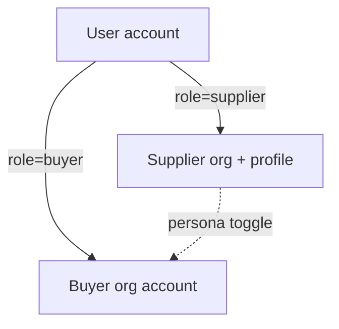
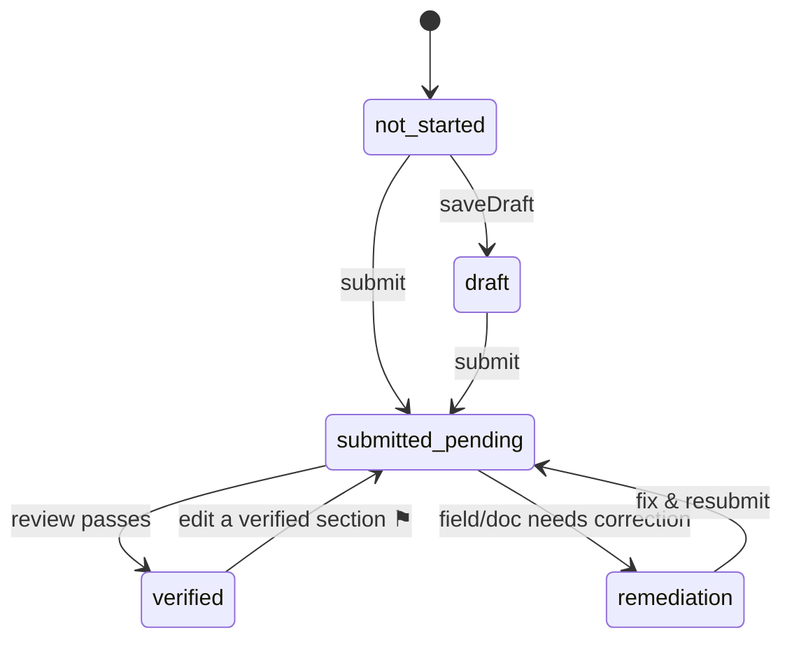
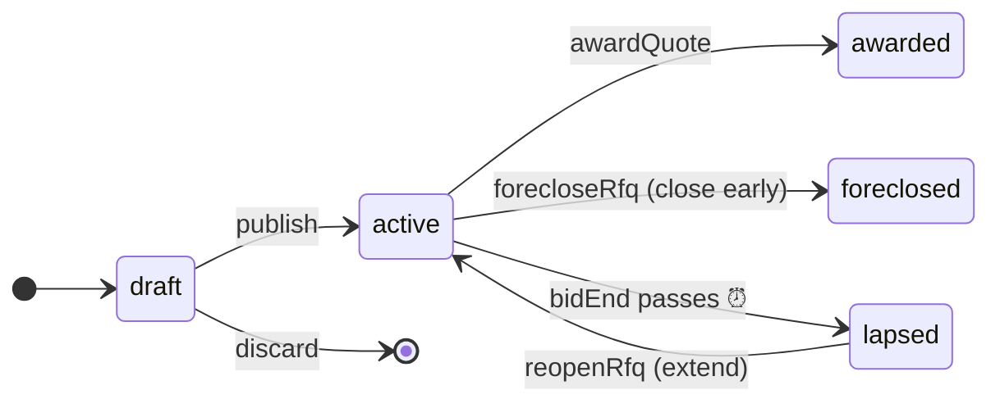
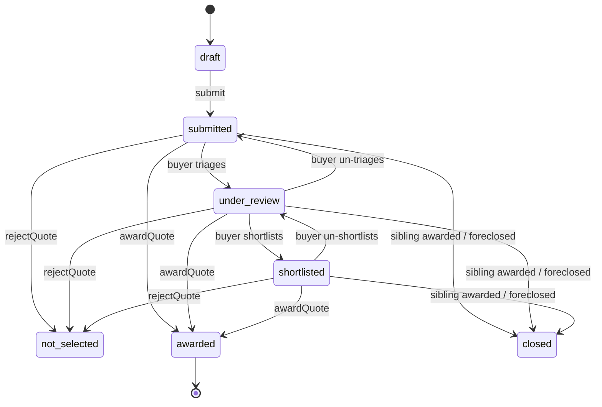
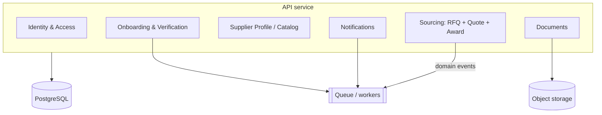
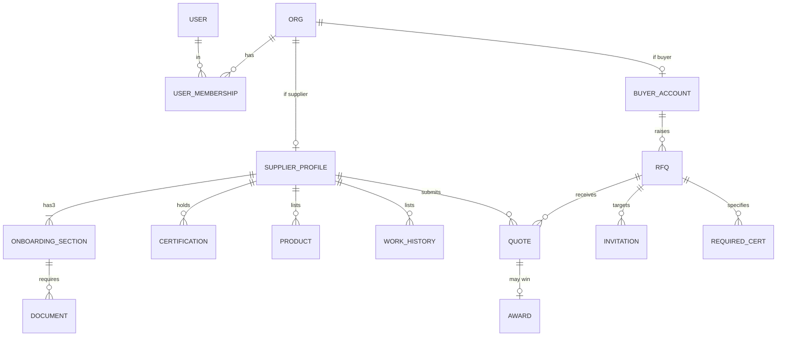
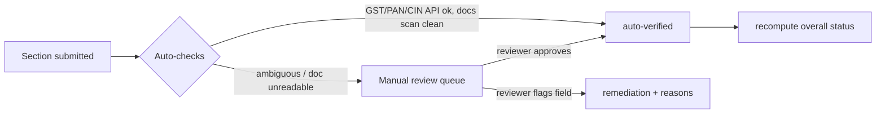

# SourceSutra — Business Logic

> Companion to [`userjourney.md`](./userjourney.md). That document maps **what the screens do**;
> this one specifies **the rules that must be true underneath them** and **how to build a real
> backend that enforces them**. It turns a click-through prototype (faked with `setTimeout` +
> `localStorage`) into a buildable system.

**How to read this doc**

- **Part A — Domain rules** is tech‑agnostic: entities, state machines, derived fields, validation,
  and a permission matrix. This is the contract. It holds whether the backend is Node, Go, or Rails.
- **Part B — Backend design** is one concrete, pragmatic way to implement Part A: bounded contexts,
  a data model, an API surface, events, auth, and the verification pipeline. Opinionated but swappable.
- **Part C — Roadmap** phases the build MVP‑first, each phase carrying its own rules + data + APIs +
  a "done" bar.

Anything marked **⚑ decision** is currently undefined in the prototype (or faked with a constant) and
needs a product call before build. They're collected in [§C.6](#c6-open-decisions).

---

## Table of contents

**Part A — Domain rules**
- [A.1 Ubiquitous language & core entities](#a1-ubiquitous-language--core-entities)
- [A.2 Actors, accounts & the persona model](#a2-actors-accounts--the-persona-model)
- [A.3 State machine — supplier onboarding (per section)](#a3-state-machine--supplier-onboarding-per-section)
- [A.4 Derived field — overall onboarding status](#a4-derived-field--overall-onboarding-status)
- [A.5 State machine — RFQ lifecycle](#a5-state-machine--rfq-lifecycle)
- [A.6 State machine — Quote lifecycle](#a6-state-machine--quote-lifecycle)
- [A.7 The award transaction (the one true invariant)](#a7-the-award-transaction-the-one-true-invariant)
- [A.8 Computed fields & scoring](#a8-computed-fields--scoring)
- [A.9 Validation rules](#a9-validation-rules)
- [A.10 Permission & visibility matrix](#a10-permission--visibility-matrix)
- [A.11 System invariants](#a11-system-invariants)

**Part B — Backend design**
- [B.0 Chosen architecture — Vercel + Supabase](#b0-chosen-architecture--vercel--supabase)
- [B.0.1 Decision log — how we chose Vercel + Supabase](#b01-decision-log--how-we-chose-vercel--supabase)
- [B.1 Architecture & bounded contexts](#b1-architecture--bounded-contexts)
- [B.2 Data model](#b2-data-model)
- [B.3 API surface](#b3-api-surface)
- [B.4 Domain events](#b4-domain-events)
- [B.5 Auth & identity](#b5-auth--identity)
- [B.6 Verification pipeline (replacing the timers)](#b6-verification-pipeline-replacing-the-timers)
- [B.7 Notifications](#b7-notifications)
- [B.8 Documents & storage](#b8-documents--storage)
- [B.9 Cross-cutting concerns](#b9-cross-cutting-concerns)

**Part C — Roadmap**
- [C.1–C.5 Phases 0–4](#c-mvp-first-roadmap)
- [C.6 Open decisions](#c6-open-decisions)
- [C.7 Prototype-fake → real-rule map](#c7-prototype-fake--real-rule-map)

---

# Part A — Domain rules

## A.1 Ubiquitous language & core entities

| Term | Meaning |
|---|---|
| **Supplier** | A vetted sub‑contractor/manufacturer (mill, CMT unit, dyer, trims maker). Gets verified once; becomes discoverable. |
| **Buyer** (Customer) | A manufacturer sourcing work. Raises RFQs, awards quotes. |
| **Onboarding** | The supplier's one‑time verification across three **sections**: Identity, Financials, Portfolio. |
| **Section** | An independently‑submitted, independently‑verified slice of onboarding. Has its own state machine. |
| **Verification** | Review of a submitted section (or a single document / certification) that ends in verified or remediation. |
| **Portfolio** | The public, buyer‑facing shopfront: capacity, trade terms, products, certifications, work history. |
| **Certification** | A named standard (ISO 9001, GOTS, GRS, SA8000…) or a **Buyer/Brand audit**, with issuer, dates, docs, and a computed **badge**. |
| **RFQ** | A buyer's sourcing request. Has a bid window, requirements, required certs, and a visibility rule. |
| **Quote** | A supplier's response to an RFQ. Competes with sibling quotes on the same RFQ. |
| **Award** | The buyer selecting one quote. Single‑award, irreversible in v1. Closes the RFQ and all siblings. |
| **Invitation** | A buyer directing a specific supplier to an RFQ (restricted visibility). |
| **Match** | Computed fit between a supplier/quote and an RFQ's required certs + customization needs. |

**Aggregate roots** (consistency boundaries): `SupplierProfile`, `RFQ` (owns its `Quote`s for award
consistency), `BuyerAccount`, `User`.

---

## A.2 Actors, accounts & the persona model



- A **User** authenticates and holds one or more **roles**. In the prototype the two personas are
  separate apps joined by a header toggle; the real model is **one user, one primary role, org‑scoped
  membership**.
- **Supplier auth:** Google only (no password path). Sign‑up and log‑in are the same action.
- **Buyer auth:** Google **or** email+password, plus business info (company, products‑sourced tags,
  phone) and a **required consent checkbox**. Account type fixed to *Customer (Buyer)*.
- **Org scoping:** every RFQ/quote/profile belongs to an **org**, not a user, so teammates can share
  a buyer/supplier account. **⚑ decision:** is multi‑user‑per‑org in scope for v1? (Prototype assumes
  one identity per org.)
- **Persona switching** is a convenience in the prototype. Real rule: a user may hold both roles, but
  **actions are always evaluated against the currently‑active org context**.

---

## A.3 State machine — supplier onboarding (per section)

Each of the three sections (Identity, Financials, Portfolio) runs this machine **independently**.



**Transitions, guards, actions**

| From → To | Trigger | Guard | Action / side effects |
|---|---|---|---|
| `not_started/draft → submitted_pending` | `submit` | **all required fields present & valid** (§A.9); for **Financials**, Identity must already be `submitted_pending`+ | freeze a **submission snapshot**; enqueue review; emit `SectionSubmitted` |
| `submitted_pending → verified` | review passes | reviewer/automation approves every doc | set section `verified`; recompute overall status; emit `SectionVerified` |
| `submitted_pending → remediation` | any field/doc flagged | reviewer marks ≥1 item `needs_correction` | attach remediation reasons per field; emit `SectionRemediation`; notify supplier |
| `remediation → submitted_pending` | `resubmit` | flagged items edited | re‑enqueue review |
| `verified → submitted_pending` | supplier edits a verified section | — | **⚑ decision:** does editing a verified section re‑open verification, or is there field‑level re‑verification? Prototype lets you "Edit" but doesn't model the re‑review. Recommend: editing **verification‑relevant** fields (docs, legal numbers) re‑opens; editing cosmetic portfolio fields does not. |

**Gating rules (hard):**

1. **Financials is locked until Identity is *submitted*** (not verified). Weight/lock reason surfaces
   on the dashboard until then.
2. **Portfolio** is open any time but is expected **submitted last**.
3. **Marketplace access** (Discover RFQs, submit quotes) unlocks **only at `Onboarding Completed`**
   (§A.4). Before that a supplier can browse nothing sensitive and cannot quote.

**Document‑level & certification‑level sub‑states.** Registration docs (GST/PAN/MSME/CIN), financial
docs (MGT‑7 ×3 FYs), and each certification carry their **own** status independent of the section:
`empty → uploaded → in_progress → verified | needs_correction`. A section can't reach `verified`
while a required doc is `needs_correction`.

**Privacy rule (codify from prototype):** OTP‑verified identifiers (Aadhaar, email, phone) store
**only the verification result and a last‑4 / masked form — never the full number**. This is a hard
data rule, not a UI nicety.

---

## A.4 Derived field — overall onboarding status

`overallStatus` is **computed**, never stored as a source of truth. Inputs: the three section states.

| Overall status | Condition (in priority order) |
|---|---|
| **To be Started** | all three sections `not_started` |
| **Verification – Remediation Required** | any submitted section in `remediation` |
| **Verification In Progress** | Identity or Financials in `submitted_pending` |
| **Verification Completed – Portfolio Required** | Identity **and** Financials `verified`, Portfolio not yet submitted |
| **Onboarding Completed** | Identity **and** Financials `verified` **and** Portfolio `submitted_pending`\|`verified` |
| **Draft** | any progress, none of the above (fallback) |

> Evaluate top‑to‑bottom; first match wins. (Remediation outranks "in progress" so a flagged supplier
> always sees the actionable state.)

**Progress percent** (weave bar): weighted completion, **Identity 40% · Financials 40% · Portfolio
20%**. A section contributes its full weight at `verified` (Portfolio at `submitted_pending`+), partial
weight for `draft`/`submitted_pending`. **⚑ decision:** exact partial‑credit curve — the prototype
renders a bar but the precise per‑state fraction isn't pinned. Recommend: `not_started 0`, `draft 0.4`,
`submitted_pending 0.7`, `verified 1.0`, times the section weight.

---

## A.5 State machine — RFQ lifecycle



| Transition | Trigger | Guard | Action |
|---|---|---|---|
| `draft → active` | `publish` | all **required** fields valid (§A.9); `bidStart ≤ bidEnd`; `deliveryDate` after `bidEnd` | set `publishedDate`; snapshot visibility rule; fan out to eligible suppliers per who‑can‑respond; emit `RfqPublished` |
| `active → lapsed` | **bid window ends** (`now > bidEnd`) | — | **scheduled job**, not a user action. Prototype *seeds* lapsed RFQs; the real system needs a clock. Emit `RfqLapsed`. |
| `lapsed → active` | `reopenRfq` | new `bidEnd > now`; RFQ has ≥1 application (per prototype: reopen offered on lapsed RFQs with applications) | extend `bidEnd`; emit `RfqReopened` |
| `active → foreclosed` | `forecloseRfq` | RFQ is `active` | record `closeReason`; open quotes → `closed`; emit `RfqForeclosed` |
| `active → awarded` | `awardQuote` | see §A.7 | the award transaction |

**Note the missing edge:** a **lapsed** RFQ cannot be awarded directly — it must be re‑opened first
(→ active → award). Enforce this; the prototype's UI implies it but doesn't guard it.

---

## A.6 State machine — Quote lifecycle



| Transition | Trigger | Guard | Notes |
|---|---|---|---|
| `draft → submitted` | supplier `submit` | RFQ is `active`; supplier is `Onboarding Completed`; quote passes §A.9; **one live quote per (supplier, RFQ)** | emits `QuoteSubmitted`; surfaces in buyer's applications |
| `submitted ↔ under_review ↔ shortlisted` | **buyer triage (manual)** | buyer owns the RFQ | **Resolved:** triage is a manual buyer tool, **not** auto by match threshold; freely **reversible** both ways. States are **visible to the supplier** (badges, per prototype). Shortlist is optional — **not** a precondition for award. |
| `* → not_selected` | `rejectQuote(reason?)` | buyer owns RFQ; quote non‑terminal (incl. `shortlisted`) | RFQ **stays active**; optional reason stored |
| `* → awarded` | `awardQuote` | §A.7 — target quote **non‑terminal** (any of submitted / under_review / shortlisted) | terminal winner |
| `submitted/under_review/shortlisted → closed` | sibling awarded **or** RFQ foreclosed | — | terminal; supplier sees "Not selected / Closed" |

**One‑live‑quote rule:** a supplier may hold at most one non‑terminal quote per RFQ. Re‑submitting
updates the existing quote (prototype `upsertQuote`), it does not create a second application.

---

## A.7 The award transaction (the one true invariant)

`awardQuote(quoteId)` is the system's most important atomic operation. In the prototype it's three
sequential `localStorage` writes; in production it **must be a single transaction** with the RFQ
aggregate locked.

**Preconditions (guards):**
- Caller is the RFQ's buyer.
- RFQ is `active`.
- Target quote belongs to that RFQ and is non‑terminal.
- RFQ has no existing `awardedQuoteId` (**award is idempotent & one‑shot**).

**Effects (all‑or‑nothing):**
1. Target quote → `awarded`.
2. **Every sibling quote on the same RFQ → `closed`.**
3. RFQ → `awarded`, set `awardedQuoteId`, stamp `awardedAt`.
4. Emit `QuoteAwarded` + `RfqAwarded` (drives notifications, and later post‑award project creation).

**Irreversibility:** v1 has **no un‑award**. The UI copy already says "irreversible"; enforce it
server‑side (reject any state change on an `awarded` RFQ). **Resolved:** **no un‑award in v1** — a
mistaken award is corrected only by a manual ops/DB action for now; a proper privileged, audited
admin reversal is deferred to **Phase 4** (admin console), and is never a buyer action.

**Concurrency:** two buyers can't race here (single owner), but a buyer double‑clicking can. Use an
**idempotency key** on the award request and a row‑level lock / optimistic version on the RFQ so the
second attempt is a no‑op, not a double‑fire.

**Split awards are explicitly out of scope for v1** (single‑award only). See Phase 4.

---

## A.8 Computed fields & scoring

All of these are **derived on read** from stored primitives — never hand‑set.

### A.8.1 Certification badge

Ported exactly from the prototype's `computeBadge`, evaluated in this order:

```
if (!doesNotExpire && expiryDate < today)                 → "Expired"
else if (daysUntil(expiryDate) between 0 and 60)          → "Expiring soon"
else if (fieldStatus === "verified")                      → "Verified"     (buyer view: "Certified")
else                                                       → "Self-declared" (buyer view: "Claimed")
```

**⚑ decision — badge vocabulary gap.** `userjourney.md` §10 lists nine badge labels (adds *Registered*
for regulatory certs, *Needs correction*, and audit outcomes *Passed / Passed with corrective actions
/ Failed / Pending*). The code only computes the **four** above. Before build, decide the full set and
their rules:
- **Registered** — for regulatory/statutory records (e.g. Factory Licence) vs. voluntary standards.
- **Needs correction** — when the cert doc `fieldStatus === needs_correction`.
- **Audit outcomes** — for the *Buyer / Brand Audits* category, badge = the recorded `outcome`, not the
  expiry logic.

Buyer‑facing labels differ from supplier‑facing (Verified→Certified, Self‑declared→Claimed); keep one
computation, two label maps.

### A.8.2 Cert‑match (quote ↔ RFQ)

For each `RFQ.requiredCerts[{category, name, priority}]`:

```
held = supplier.certsHeld includes key "{category}::{name}"
row  = { name, priority, status: held ? "Held" : "Gap" }
```

`certsHeld` is a set of `"Category::Name"` keys derived from the supplier's **verified** certifications.
The supplier's quote UI and the buyer's application UI render the same rows. **Match score** (for
sorting/"matching count"):

```
mustHaves   = requiredCerts where priority = "must"
niceToHaves = requiredCerts where priority = "nice"
meetsAllMustHaves = every mustHave is Held
matchScore  = weighted( mustHaves Held, niceToHaves Held )   // must-haves dominate
```

**Match score is advisory** — it drives *default sort order* and the "matching count," and is displayed
to both personas; it **never** gates eligibility, shortlisting, or award (all manual buyer decisions —
§A.6). The `priority` (must/nice) tag is stored purely as display/ranking metadata.
**Default Applications order** (buyer's view): `matchScore` desc, tie‑break unit price asc; the buyer
can re‑sort, and **nothing is hidden or filtered out**.

### A.8.3 Customization coverage

```
coverage = | RFQ.customizationNeeds ∩ supplier.customizationCapabilities | / | RFQ.customizationNeeds |
```
(1.0 when the RFQ has no customization needs.)

### A.8.4 Matching‑supplier count (RFQ wizard)

**Currently hardcoded to `14`** in `CustomerCreateRFQ.dc.html` — this is a fake, not logic. Real rule
(**Resolved:** certs, coverage, and contract‑type are *advisory* — they rank/display, never filter):

```
count = suppliers where
    status = Onboarding Completed (verified)
  AND (RFQ.preferredLocation empty OR supplier.location matches)
  AND (RFQ.minYearsExperience empty OR supplier.yearsInBusiness ≥ it)
```
Recomputed live as the buyer edits the wizard. **Must/nice‑have certs, customization coverage, and
contract type do NOT include/exclude** — they only order the ranked results (§A.8.2). Contract type has
**no structured supplier field** (suppliers self‑select whether to quote); revisit post‑MVP.

> **The count is a soft indicator, not the responder set.** `preferredLocation` / `minYearsExperience`
> are advisory too — they shape this count but do **not** gate who may respond. Under `open`, *any*
> verified supplier can quote (§A.8.6), so the real responder set is usually larger than this number;
> say so in wizard microcopy. Only verified‑status and the invite‑list ever gate a response.

### A.8.5 RFQ completion meter (publish readiness)

```
requiredComplete = count(required fields filled) / count(required fields)
ready = requiredComplete == 1  AND  bid window valid  AND  deliveryDate valid
```
Attachments and matching count are shown but **not** gating.

### A.8.6 Who‑can‑respond → eligible supplier set

**Resolved:** three modes — the auto‑`matching` mode is **dropped** (eligibility never uses the match
filter). Only verified‑status and the invite‑list ever gate a response.

| `whoCanRespond` | Eligible set at publish |
|---|---|
| `open` | every `Onboarding Completed` supplier |
| `verifiedOnly` | every `Onboarding Completed` supplier — **behaviourally identical to `open` today** (the whole marketplace is already verified). Stored as buyer *intent*; a real difference is reserved for possible logged‑out/public discovery (open decision #5). |
| `invite` (specific) | only `invitedSuppliers[]` — creates **Invitations**; the RFQ is **not** visible to non‑invitees |

An RFQ a supplier is **invited** to appears in their *Invitations* tab even if it wouldn't otherwise
match; a supplier **not** in an invite‑only RFQ's list must not see it in Discover.

---

## A.9 Validation rules

| # | Rule | Where | Severity |
|---|---|---|---|
| V1 | **Account number == confirm account number** (mismatch check) | Financials | block submit |
| V2 | **Financials locked until Identity submitted** | Onboarding | block open |
| V3 | Required identity fields present (company, contact, designation, established, nature, years) | Identity | block submit |
| V4 | OTP‑verified email + phone before Identity submit; Aadhaar result present | Identity | block submit |
| V5 | MGT‑7 present for **each of the last 3 FYs** | Financials | block submit |
| V6 | **`bidStart ≤ bidEnd`**, both dates present | RFQ publish | block publish |
| V7 | **`deliveryDate` after `bidEnd`** (validated after the bid window) | RFQ publish | block publish |
| V8 | Sample fields (type/count/deadline/who‑pays) required **only if** `sampleRequired` | RFQ + Quote | conditional |
| V9 | `targetPrice` **never required to disclose** (pricing approach can hide it) | RFQ | allow empty |
| V10 | Colour/size **breakdown** running total vs total quantity | RFQ step 2 | **warn only** |
| V11 | Quote only if supplier `Onboarding Completed` **and** RFQ `active` | Quote submit | block |
| V12 | One live quote per (supplier, RFQ) | Quote submit | upsert not insert |
| V13 | Award/reject/foreclose/reopen require **RFQ ownership** by caller | Buyer actions | authz |
| V14 | Reopen `newBidEnd` must be in the future | Reopen | block |
| V15 | Consent checkbox required on buyer registration | Register | block |

**Resolved (V10):** the breakdown total is **advisory** — show a running‑total warning on any mismatch
(over or under) but **never block publish**. The buyer stays in control; a partial or over‑allocated
breakdown can still publish.

---

## A.10 Permission & visibility matrix

The single most important product rule: **buyers never see a supplier's Identity or Financials.**

| Resource | Supplier (owner) | Other suppliers | Buyer | Public/unauth | Admin |
|---|---|---|---|---|---|
| Own Identity section | RW | — | **never** | — | R (verification) |
| Own Financials section | RW | — | **never** | — | R (verification) |
| Own Portfolio | RW | — | R (public profile) | R (public fields ⚑) | R |
| Supplier public profile | R | R ⚑ | R | ⚑ | R |
| RFQ (draft) | — | — | RW (owner only) | — | R |
| RFQ (active) | R (if eligible per §A.8.6) | R (if eligible) | RW (owner) / **R (all buyers)** | — | R |
| Own quote | RW | — | R (as application, once submitted) | — | R |
| Sibling quotes on an RFQ | — | **never** (no competitor visibility) | R (RFQ owner) | — | R |
| Award/reject/foreclose | — | — | **RFQ owner only** | — | R + reversal |
| Buyer profile | — | — | RW (owner) | — | R |

**⚑ decisions:**
- Are supplier public profiles visible to **logged‑out** visitors (SEO/discovery) or auth‑walled?
- Can suppliers browse **each other's** public profiles, or only buyers?
- Can a buyer view an active RFQ they **don't** own?

**Hard rule regardless:** a supplier can never see a competitor's quote on the same RFQ; a buyer can
never see another buyer's RFQ applications.

---

## A.11 System invariants

Things that must hold after **every** operation (good targets for property tests):

1. An RFQ has **at most one** `awardedQuoteId`, and it references a quote whose `status = awarded`.
2. If `RFQ.status = awarded`, exactly one of its quotes is `awarded` and **all others** are `closed`
   or `not_selected` (none left `submitted`/`under_review`/`shortlisted`).
3. A supplier can submit a quote **iff** their `overallStatus = Onboarding Completed`.
4. `Financials.status` can only leave `not_started` if `Identity.status ≥ submitted_pending`.
5. No stored record ever contains a full Aadhaar / bank account number in plaintext beyond what masking
   allows (account number kept for payouts is encrypted at rest, never returned in profile reads).
6. `overallStatus` and every badge/score is **reproducible** from stored primitives (no drift between
   what's stored and what's shown).
7. A `foreclosed` or `awarded` RFQ accepts **no** new quotes.

---

# Part B — Backend design

> **Decision (2026‑08‑10): the build target is Vercel + Supabase** — the "leanest tokens" bundle.
> [§B.0](#b0-chosen-architecture--vercel--supabase) is the concrete architecture. The rest of Part B
> (B.1–B.9) is the **reference model** it implements: the bounded contexts, data model, events, and
> rules are unchanged — only *where the code runs* differs (Postgres/RLS/Edge Functions instead of a
> container service). Read B.0 for "what we're building"; read B.1–B.9 for "what it must do."

## B.0 Chosen architecture — Vercel + Supabase

**Why this bundle:** fewest build tokens (the backend is mostly your Postgres schema + a few
functions — the auto REST/GraphQL API, auth, storage, and realtime are generated), and **mobile‑ready
by construction** — the same Supabase project serves the web app and a future mobile app through
first‑class SDKs (Swift/Kotlin/Flutter/JS) or the auto REST. Accepted trade‑off: complex logic lives
in Postgres/Edge Functions rather than one application service layer (mitigations below).

### Runtime topology

| Layer | Product | Runs on |
|---|---|---|
| Web client | Next.js (rebuilt from the `.dc.html` prototype) | **Vercel** (Mumbai edge) |
| Mobile client (future) | Native / Flutter / RN via **Supabase SDK** or auto REST | app stores |
| Auto API | **PostgREST (REST) + GraphQL**, generated from the schema | Supabase |
| Custom API | **Edge Functions** (Deno/TypeScript) for transactional + external‑I/O endpoints | Supabase |
| Auth | **Supabase Auth** — Google (suppliers), email/password (buyers); JWT for web + mobile | Supabase |
| Database | **Postgres** + Row‑Level Security + Postgres functions | Supabase |
| Storage | **Supabase Storage** (buckets w/ RLS) for documents & photos | Supabase |
| Realtime / notifications | **Supabase Realtime** + Edge Function fan‑out | Supabase |
| Scheduled jobs | **pg_cron** / scheduled Edge Functions (bid‑window lapse, cert expiry) | Supabase |

### Where domain logic lives (the one call this bundle forces)

Supabase offers three homes; use each for what it's best at — this split is what keeps it token‑cheap
*and* correct:

| Concern | Home | Why |
|---|---|---|
| **Permission & visibility matrix (§A.10)** | **RLS policies** | The matrix maps almost 1:1 to row‑level policies — a buyer physically cannot read Identity/Financials rows. Authz enforced by the DB, not app code: fewest tokens, hardest to bypass. |
| **Transactional invariants — award (§A.7), quote upsert, publish guards** | **Postgres functions (plpgsql) via RPC** | The award cascade is a few SQL statements in one transaction; `UNIQUE(rfq_id)` + `SELECT … FOR UPDATE` give atomicity + idempotency natively. |
| **State‑machine transition guards (§A.3/A.5/A.6)** | **Postgres functions + triggers** | Guards are row predicates; a trigger rejects any illegal transition. |
| **Derived fields — badges, match, coverage, overall status (§A.8)** | **Postgres views / generated columns** | Computed on read from primitives (invariant A.11.6); no drift. |
| **External I/O — OTP, doc scan, KYC lookups, notifications, verification pipeline (§B.6)** | **Edge Functions (TS)** | Anything calling the outside world or orchestrating a workflow; also the webhook targets if we add QStash/Inngest for durable retries. |
| **Async jobs / fan‑out (the ex‑`setTimeout` work)** | **Edge Functions triggered by Realtime / pg_net / Cron** | Replaces the container "worker" — no long‑running process needed. |

### Deploy flow

1. **DB is the source of truth:** schema, RLS policies, and Postgres functions live as **Supabase
   migrations** (`supabase/migrations/*.sql`) in the repo — never clicked into the dashboard.
2. **Edge Functions** live in `supabase/functions/*`, deployed via the Supabase CLI in CI.
3. **GitHub Actions** on push → `supabase db push` (migrations) + `supabase functions deploy`, then
   **Vercel** deploys the Next.js frontend. Vercel preview deploy per PR; a Supabase branch/project per
   environment (prod + staging).

### Keeping the trade‑off safe

- All SQL logic (functions, RLS) is **versioned migration code**, tested with **pgTAP** — the §A.11
  invariants become property tests.
- Edge Functions stay **thin** (orchestration + external calls only).
- **Escape hatch:** if logic outgrows the DB — e.g. split awards or heavy post‑award ops in Phase 4 —
  add a single container service (Fly.io Mumbai) against the *same* Postgres, with no change to the
  frontend or mobile clients.

### API surface note (updates §B.3)

Most reads/writes are the **auto PostgREST/GraphQL** API guarded by RLS. Only these become explicit
**Edge Functions / RPC** (because they're transactional or touch the outside world):
`award`, `publish_rfq`, `submit_quote` (upsert + guards), `foreclose`/`reopen`, `submit_section`,
`verify_otp`, and the verification‑pipeline webhooks. The `match-count` and all badges/scores are
**views**, read directly.

## B.0.1 Decision log — how we chose Vercel + Supabase

*Captured 2026‑08‑10 so the reasoning survives the conversation it came from. The driving constraint
was explicit: **build with the least (build‑time) tokens without sacrificing usability, functionality,
or extensibility**, with an **API‑first backend a mobile app can consume later**, for **India‑based**
suppliers and buyers.*

### D1 — API style: REST + OpenAPI (not GraphQL, not tRPC)
- **Chosen:** a versioned REST API that auto‑publishes an **OpenAPI** spec; every client (web now,
  mobile later) codegens a typed SDK from it.
- **Why:** language‑agnostic — a future Swift/Kotlin/Flutter app generates a client for near‑zero extra
  work. **tRPC** was rejected because its typed‑client magic is TypeScript‑only (only pays off if mobile
  is React Native). **GraphQL** was rejected as more schema/resolver code — more tokens — than this
  domain needs. With Supabase this REST surface is *generated* by PostgREST (see D2).

### D2 — Where the backend runs: the token ↔ control spectrum
Three archetypes weighed against "fewest tokens, but keep functionality + extensibility":

| Archetype | Example | Build tokens | Domain logic (award txn, state machines) | Admin / verification queue | Verdict |
|---|---|---|---|---|---|
| **BaaS** | **Supabase** | lowest | awkward — lives in SQL/Edge Functions | limited (Studio) | **chosen** |
| Batteries framework | Django + Ninja | low | native service layer | **free (Django admin)** | strong runner‑up |
| Assemble‑your‑own | FastAPI / NestJS | high | native | build it yourself | rejected (most tokens) |

- **Chosen: Supabase** — leanest token count (REST/GraphQL API, auth, storage, realtime are generated
  from the schema; the backend is mostly migrations + a few functions).
- **Accepted trade‑off:** complex logic (the award cascade, verification workflow) lives in
  Postgres/Edge Functions rather than one app service layer — mitigated by the §B.0 logic‑placement
  split (RLS for authz, Postgres functions for transactions, Edge Functions for external I/O) and the
  §B.0 escape hatch.
- **Why Django was the close runner‑up (and stays the fallback):** its free admin is a near‑perfect fit
  for the ops/verification review queue, and domain logic stays clean Python. If logic‑in‑DB ever bites,
  Django‑on‑a‑container is the pre‑vetted plan B.

### D3 — Deployment: why not "just deploy to Vercel," and the two bundles
- **Deploy does not separate FastAPI from Django** — both are Python apps in a container behind an ASGI
  server, needing the *same* five processes: web API, Postgres, object storage, a **background
  worker + queue**, and a **scheduler** (bid‑window lapse, cert expiry). Framework choice is a
  *build‑effort* decision, not a deploy one.
- **Vercel is a poor host for *this* backend on its own.** It's serverless: no long‑running worker (async
  verification/notifications would need Upstash QStash / Inngest), Postgres connection exhaustion without
  a pooler, and Python cold starts. Bolting those on means *more* vendors — the opposite of the token
  goal. Vercel *is* the right home for the **web frontend**.
- **India latency** matters for the app and future mobile client, so a **Mumbai region** was a
  requirement — favouring Fly.io (bom) or Cloud Run (asia‑south1) for any container backend.
- **The two coherent bundles considered:**
  - **Bundle A (chosen):** Vercel (Next.js web) + **Supabase** (DB/auth/storage/Edge Functions). Leanest
    tokens; logic‑in‑DB.
  - **Bundle B (fallback):** Vercel (web) + **Django/FastAPI on Fly.io/Cloud Run** + managed Postgres +
    object storage. More tokens, full control, free admin (Django).

  Bundle A won on the stated priority (fewest tokens); Bundle B is the documented escape hatch.

### D4 — Ambition: MVP‑first, phased
Sequenced Phase 0→4 (Part C) rather than designed all at once, so a launchable core ships before
deferred features (post‑award ops, split awards, notifications). Undecided items are tracked as ⚑
decisions in §C.6.

## B.1 Architecture & bounded contexts



**Contexts (own their tables, talk via events, not shared writes):**

| Context | Owns | Key operations |
|---|---|---|
| **Identity & Access** | `users`, `orgs`, `memberships`, sessions | auth, role/org resolution, consent |
| **Onboarding & Verification** | `sections`, `documents`, verification queue | submit/verify/remediate; derive overall status |
| **Supplier Profile / Catalog** | `supplier_profiles`, `products`, `certifications`, `work_history`, `facility_photos` | edit portfolio; compute badges; expose public view |
| **Sourcing** | `rfqs`, `quotes`, `invitations`, awards | publish, quote, triage, **award**, foreclose, reopen; matching |
| **Notifications** | `notifications`, delivery log | fan‑out on events |
| **Documents** | upload sessions, virus/format scan, storage refs | presigned upload; scan; attach |

The prototype's shared `RFQStore` becomes the **Sourcing** context. Everything currently faked with
timers becomes real operations in **Onboarding/Verification** + **Notifications**.

## B.2 Data model



**Notable columns / rules baked into schema:**

- `onboarding_section(supplier_id, kind ∈ {identity,financials,portfolio}, status, submitted_snapshot jsonb, weight)`
  — **unique(supplier_id, kind)**; `overall_status` is a **view / computed**, never a column.
- `certification(..., field_status, issue_date, expiry_date, does_not_expire bool, category, name)` —
  badge is computed, not stored. Add a `kind ∈ {standard, regulatory, audit}` to drive the
  *Registered*/audit badge decisions (§A.8.1 ⚑).
- `rfq(..., status, bid_start, bid_end, delivery_date, pricing_approach, target_price NULLABLE,
  visibility ∈ {open,matching,invite}, verified_only bool, awarded_quote_id NULLABLE, close_reason)`.
- `quote(..., rfq_id, supplier_id, status, ...)` — **partial unique index** enforcing *one non‑terminal
  quote per (rfq_id, supplier_id)* (invariant §A.6 / V12).
- `award(rfq_id UNIQUE, quote_id, awarded_by, awarded_at)` — the **UNIQUE(rfq_id)** column is the
  database‑level guard that makes double‑award impossible (invariant A.11.1).
- **Sensitive fields** (bank account #, Aadhaar) → encrypted column / separate vault table, never in the
  profile‑read projection.

## B.3 API surface

REST shown; a GraphQL gateway would expose the same operations. All mutating routes are
authenticated, org‑scoped, and authorized per §A.10.

**Auth & accounts**
```
POST /auth/google            supplier & buyer OAuth
POST /auth/register          buyer email+password (+consent, business info)
POST /auth/login
GET  /me                     resolves user + active org + role
```

**Onboarding (supplier)**
```
GET  /onboarding                       three sections + computed overall status + progress%
PUT  /onboarding/{section}/draft       save draft
POST /onboarding/{section}/submit      guarded by §A.9; → submitted_pending
POST /onboarding/{section}/resubmit    from remediation
POST /verify/otp/{channel}             email|phone|aadhaar — returns result only (never the number)
```

**Profile / catalog**
```
GET  /suppliers/{id}                   PUBLIC projection (no Identity/Financials)  §A.10
GET  /suppliers                        discover + filter (type, location, tags AND-across)
PUT  /profile/portfolio                edit portfolio
POST /profile/certifications           add cert (+doc)  → badge computed on read
```

**Sourcing — buyer**
```
POST /rfqs                             create draft
PUT  /rfqs/{id}                        edit draft
POST /rfqs/{id}/publish                V6/V7 guards → active; fan out per visibility
GET  /rfqs?status=&mine=true           My RFQs, filtered
GET  /rfqs/{id}/applications           sibling quotes + cert-match + coverage (owner only)
POST /rfqs/{id}/award      {quoteId}   ← the award transaction, idempotency-key required
POST /quotes/{id}/reject   {reason?}
POST /rfqs/{id}/foreclose  {reason}
POST /rfqs/{id}/reopen     {newBidEnd}
```

**Sourcing — supplier**
```
GET  /rfqs/discover?type=&location=&q= eligible active RFQs only (visibility-filtered)
GET  /rfqs/{id}                        RFQ detail (if eligible) + cert-match readout
POST /quotes                           create/submit (upsert per V12) + match computed
GET  /quotes/mine                      Quotations tab (+ Invitations)
POST /quotes/{id}/draft
```

**Matching (read models)**
```
GET  /rfqs/{id}/match-count            real §A.8.4 (replaces the hardcoded 14)
```

## B.4 Domain events

Emitted via transactional outbox; drive notifications, read‑model updates, and (later) post‑award ops.

| Event | Emitted when | Consumers |
|---|---|---|
| `SectionSubmitted` / `SectionVerified` / `SectionRemediation` | onboarding transitions | Notifications; overall‑status read model |
| `SupplierOnboarded` | overall → Onboarding Completed | Notifications ("marketplace unlocked"); discovery index |
| `RfqPublished` | draft → active | fan‑out to eligible suppliers; Notifications; match index |
| `RfqLapsed` | bid window job | Notifications (buyer: reopen?) |
| `QuoteSubmitted` | supplier submits | Notifications (buyer: new application) |
| `QuoteAwarded` + `RfqAwarded` | award txn | Notifications (winner + losers); **Phase 4: create Project** |
| `RfqForeclosed` / `RfqReopened` | buyer actions | Notifications |

## B.5 Auth & identity

- **Supplier:** Google OAuth only. First sign‑in provisions org + empty supplier profile with three
  `not_started` sections.
- **Buyer:** Google **or** email+password (hash with a modern KDF), + consent + business info at
  registration.
- **Sessions:** short‑lived access token + refresh, or server sessions. Every request resolves
  `{ user, activeOrg, role }`; authorization decisions in §A.10 evaluate against `activeOrg`.
- **Consent & PII:** store consent version + timestamp. Aadhaar/OTP flows call a KYC provider that
  returns **verified/last‑4 only** — the platform never persists the full number (invariant A.11.5).

## B.6 Verification pipeline (replacing the timers)

The prototype auto‑verifies on a ~3.2 s timer. Real design:



- **Auto‑verifiable** items (GST/PAN/CIN format + government registry lookup, doc virus/format scan)
  pass without a human.
- **Everything else** lands in an **ops review queue** (an admin surface — new in the real product,
  §C.6). Reviewers approve, or flag specific fields → `remediation` with a reason the supplier sees.
- **Certifications** verify per‑record; badge flips to *Verified* only on reviewer/registry approval.
- **SLA/notifications:** submit → "in review" notice; verified/remediation → notify supplier.

## B.7 Notifications

Event‑driven, multi‑channel (in‑app + email; WhatsApp is already a supplier contact field — **⚑**
consider it a channel). Minimum set for MVP: new application (buyer), award/not‑selected (suppliers),
remediation required (supplier), onboarding complete (supplier), invitation received (supplier).

## B.8 Documents & storage

- **Presigned upload** → object storage; **scan** (AV + format/type) before `uploaded → in_progress`.
- Per‑doc status badges + remediation messages (already in the prototype's UI) map to
  `document.field_status`.
- Access‑controlled reads: identity/financial docs are **admin/owner only**; portfolio/cert docs are
  buyer‑visible where the badge is.

## B.9 Cross-cutting concerns

- **Audit log** every state transition (who, when, from→to, reason) — mandatory for verification &
  award disputes.
- **Idempotency keys** on award/publish/submit (network retries must not double‑fire).
- **Optimistic concurrency** (row version) on RFQ + section aggregates.
- **Scheduled jobs:** bid‑window lapse sweeper (`RfqLapsed`), cert **expiry** recompute (badge flips
  to *Expiring soon*/*Expired* by wall‑clock), quote‑validity expiry.
- **Time is a first‑class input** — the prototype seeds statuses; production derives lapse/expiry from
  the clock, so all date logic must be timezone‑explicit (IST).

---

# Part C — MVP-first roadmap

Each phase ships end‑to‑end (rules + data + APIs) with a **done bar**. Earlier phases are usable
without later ones.

> **Implementation status (2026‑08‑10):** **Step #1 + Phase 0 + Phase 2 are built & green** in
> `supabase/` (`0001` + `0002` + `0003`) — **71 pgTAP tests passing**. Phase 1 is next. Descriptive
> RFQ/quote fields live in a `spec jsonb` catch‑all; documents/storage (§B.8) and the `lapse` scheduler
> (pg_cron/Edge) are deferred. See `supabase/README.md`.

## C.1 Phase 0 — Accounts & access (foundation)
- **Rules:** §A.2 personas/roles/org scoping; consent (V15); permission skeleton (§A.10).
- **Data/API:** `users/orgs/memberships`; `/auth/*`, `/me`.
- **Done bar:** a supplier can sign in with Google and land on an empty onboarding; a buyer can
  register (consent enforced) and reach an empty shell. No sensitive data crosses personas.

## C.2 Phase 1 — Onboarding & verification
- **Rules:** §A.3 section machine, §A.4 overall status + progress, gating (Financials‑lock,
  marketplace‑lock), §A.9 V1–V5, privacy rule, §A.8.1 badges.
- **Data/API:** `sections`, `documents`, `certifications`; `/onboarding/*`, `/verify/otp/*`, portfolio
  edit; **verification pipeline (§B.6)** with a minimal ops review queue.
- **Done bar:** a supplier completes all three sections, hits **Onboarding Completed**, and appears in
  discovery; a real reviewer can flag a field → supplier sees remediation → resubmits → verified.

## C.3 Phase 2 — RFQ ↔ Quote ↔ Award (the marketplace core)
- **Rules:** §A.5 RFQ, §A.6 Quote, **§A.7 award transaction + all invariants**, §A.8.2–A.8.6
  matching/coverage/eligibility, §A.9 V6–V14, foreclose/reopen, lapse job.
- **Data/API:** `rfqs/quotes/invitations/awards` (with the UNIQUE(rfq_id) award guard + partial‑unique
  quote index); full buyer + supplier sourcing routes; **real match‑count** replacing `14`.
- **Done bar:** buyer publishes an RFQ → eligible suppliers see it → submit quotes → buyer awards one
  → RFQ + all siblings flip atomically, correctly, and idempotently. This phase = the prototype's whole
  value, made real.

## C.4 Phase 3 — Notifications & invitations
- **Rules:** §A.8.6 invite‑only visibility; event → notification mapping (§B.4/B.7).
- **Data/API:** `notifications`; event consumers; invitation accept/decline; supplier *Invitations* tab.
- **Done bar:** every meaningful transition reaches the right person in‑app + email; invite‑only RFQs
  are visible only to invitees.

## C.5 Phase 4 — Beyond the prototype (deferred features)
Each is a **⚑ product decision** to design when we get here:
- **Post‑award operations:** `Project` created on `RfqAwarded` → milestones, payment schedule, delivery
  tracking. (Prototype: "not built yet".)
- **Business‑performance metrics:** populate the supplier profile's empty state from completed
  projects (`hasPerformanceData`).
- **Split / multi‑supplier awards:** relax the single‑award invariant (A.11.1) — a real schema + UX
  change, not a toggle.
- **Messaging** between buyer & supplier; **WhatsApp** as a first‑class notification channel.
- **Monetization / access model:** subscription, per‑RFQ, or take‑rate on awarded orders — decides
  whether some reads move behind a paywall (affects §A.10). **Not yet modeled anywhere.**
- **Admin/ops console:** verification review queue at scale, dispute handling, award reversal.

## C.6 Open decisions

Collected `⚑` calls, roughly in the order they block a phase:

| # | Decision | Blocks |
|---|---|---|
| 1 | Multi‑user per org in v1? | Phase 0 |
| 2 | Editing a *verified* section — re‑verify all, field‑level, or cosmetic‑exempt? | Phase 1 |
| 3 | Exact progress‑bar partial‑credit fractions | Phase 1 |
| 4 | Full badge vocabulary (Registered / Needs‑correction / audit outcomes) + rules | Phase 1 |
| 5 | Public supplier profiles: logged‑out visible? supplier‑to‑supplier visible? | Phase 1/3 |
| 6 | ~~`under_review`/`shortlisted`: buyer‑manual or auto?~~ **✅ Resolved — manual (§A.6)** | Phase 2 |
| 7 | ~~nice‑to‑haves/coverage affect count or only ranking? "compatible contract type"?~~ **✅ Resolved — advisory (§A.8.4)** | Phase 2 |
| 8 | ~~Breakdown total: hard/ceiling/advisory (V10)?~~ **✅ Resolved — advisory / warn‑only (§A.9)** | Phase 2 |
| 9 | ~~Can a buyer view an active RFQ they don't own?~~ **✅ Resolved — yes, all buyers (§A.10)** | Phase 2 |
| 10 | ~~Admin‑only award reversal?~~ **✅ Resolved — no un‑award in v1; reversal → Phase 4 (§A.7)** | Phase 2/4 |
| 11 | WhatsApp as a notification channel? | Phase 3 |
| 12 | Monetization model (and what it paywalls) | Phase 4 |

**Resolved for Phase 2 (2026‑08‑10) — the sourcing model:**

1. **Certs / coverage / contract‑type are advisory everywhere** — they rank & display, never gate a
   response, the count, shortlisting, or award (§A.8.2, §A.8.4). Contract type gets no structured
   supplier field for now; suppliers self‑select whether to quote.
2. **`preferredLocation` / `minYearsExperience` are advisory too** — they shape the count/ranking but
   do **not** gate who may respond. Only verified‑status + the invite‑list gate a response (§A.8.4, §A.8.6).
3. **Shortlisting is manual and optional** — the buyer triages `submitted ↔ under_review ↔ shortlisted`
   (reversible, and **visible to the supplier**); award is allowed from **any non‑terminal** quote; a
   shortlisted quote can still be rejected (§A.6).
4. **Default Applications order:** `matchScore` desc, tie‑break unit price asc; buyer‑resortable; nothing
   hidden (§A.8.2).
5. **Who‑can‑respond:** `open` / `verifiedOnly` / `invite`; auto‑`matching` **dropped**; `open` and
   `verifiedOnly` are behaviourally identical today (§A.8.6).
6. **Breakdown total (V10) is advisory** — warn on any mismatch (over or under), never block publish (§A.9).
7. **Active‑RFQ visibility:** owner has RW; **all buyers may view** any active RFQ (view‑only market
   signal); suppliers see it only if eligible per §A.8.6 — invite‑only restricts the **supplier**
   audience, not buyer visibility. The Phase‑2 `rfqs_read` policy replaces today's loose `status='active'`
   rule with this scoping (§A.10).
8. **No un‑award in v1** — award is one‑shot / irreversible for buyers; an audited admin reversal is
   deferred to Phase 4 (§A.7).

*All Phase‑2 sourcing decisions are now settled.*

## C.7 Prototype-fake → real-rule map

The concrete gap between today's clickable prototype and the system this doc specifies:

| Prototype today | Real rule (this doc) |
|---|---|
| Verification auto‑passes on a `setTimeout(~3.2s)` | Auto‑checks + ops review queue → verified/remediation (§B.6) |
| OTP/upload resolve on `setTimeout` | Real OTP provider (result‑only) + presigned upload + scan (§B.5/B.8) |
| `matchingSupplierCount = 14` (hardcoded) | Computed match filter over verified suppliers (§A.8.4) |
| `computeBadge` produces 4 labels | Full badge vocabulary incl. Registered/audit outcomes (§A.8.1 ⚑4) |
| RFQ `lapsed` is **seeded** | Scheduled lapse job from `bidEnd` vs clock (§A.5, §B.9) |
| Award = 3 sequential `localStorage` writes | One ACID transaction + UNIQUE(rfq_id) + idempotency key (§A.7) |
| One supplier profile per app load; state resets on logout | Persistent org‑scoped profiles, verified once (§A.2) |
| Buyer never sees Identity/Financials (UI‑enforced) | Server‑enforced projection + document ACLs (§A.10, invariant A.11.5) |
| Single‑award only (UI copy) | Server‑enforced single‑award invariant; split awards = Phase 4 |

---

*Companion to `userjourney.md`. Part A is the durable contract; Part B is a recommended, swappable
implementation; Part C sequences the build MVP‑first. Resolve the §C.6 decisions with product before
starting each phase. Last updated 2026‑08‑10.*
