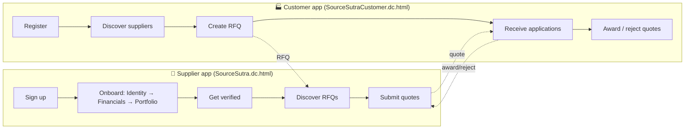
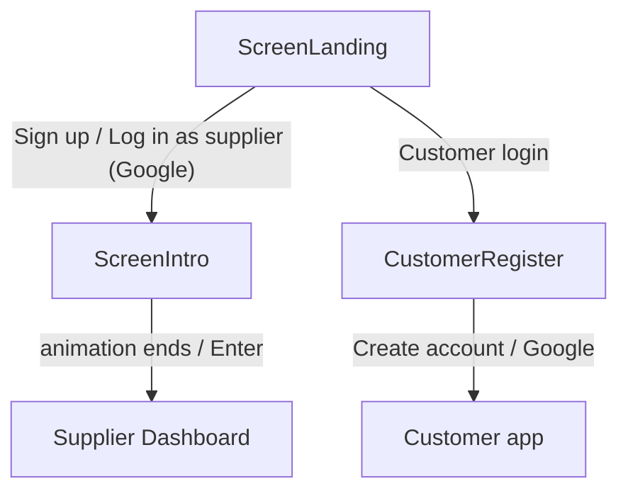
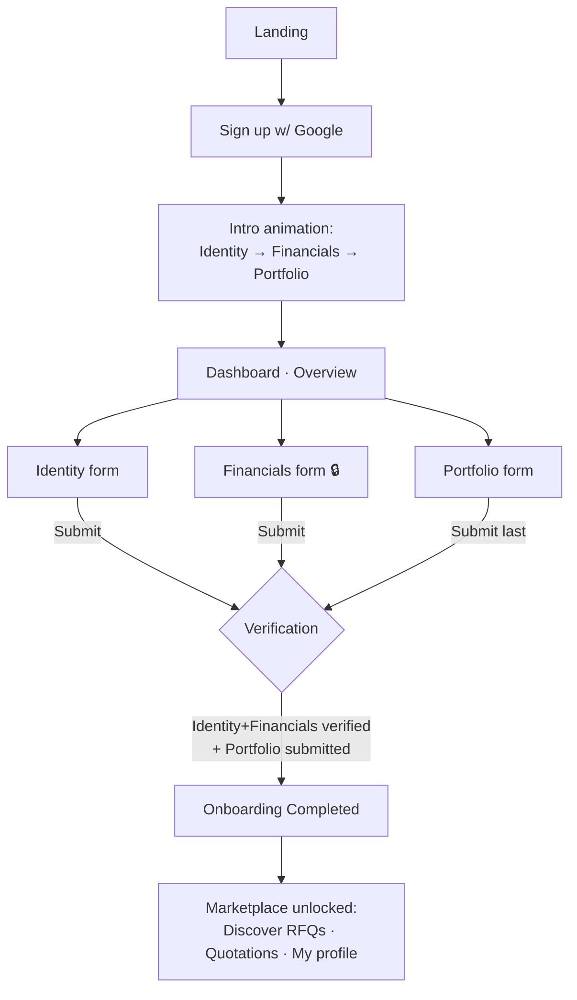
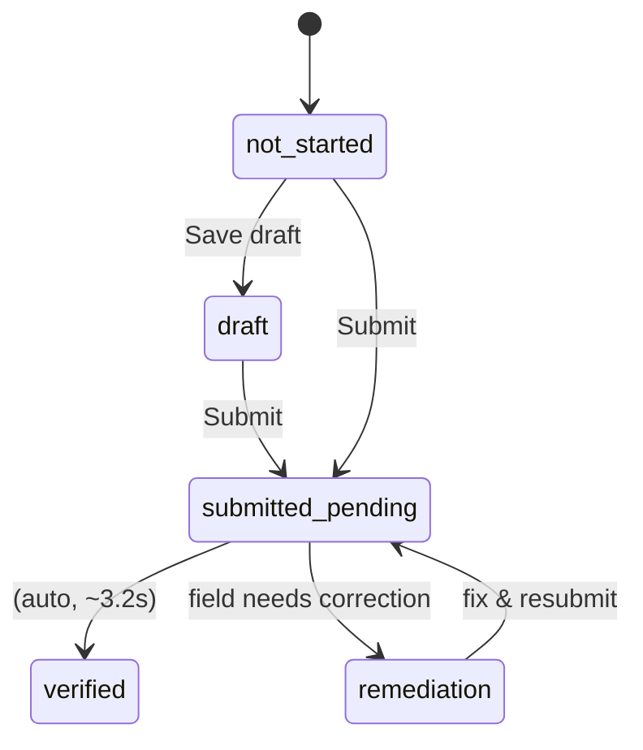
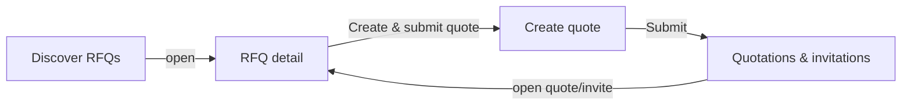
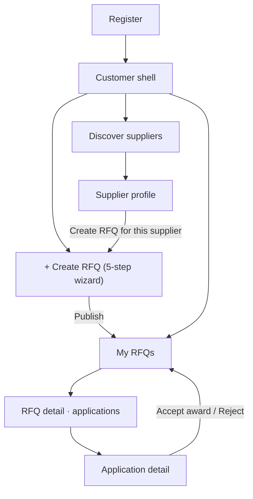
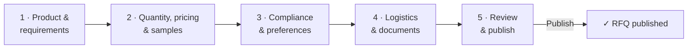
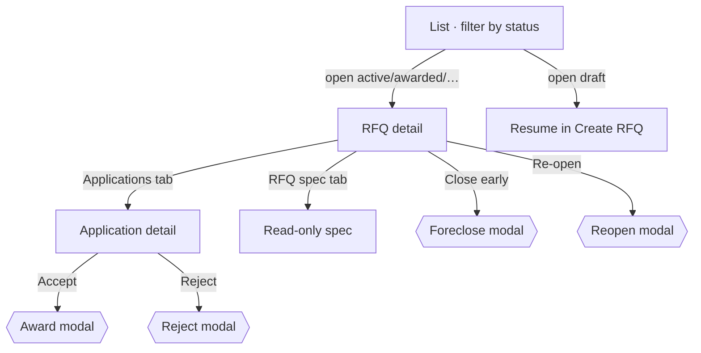
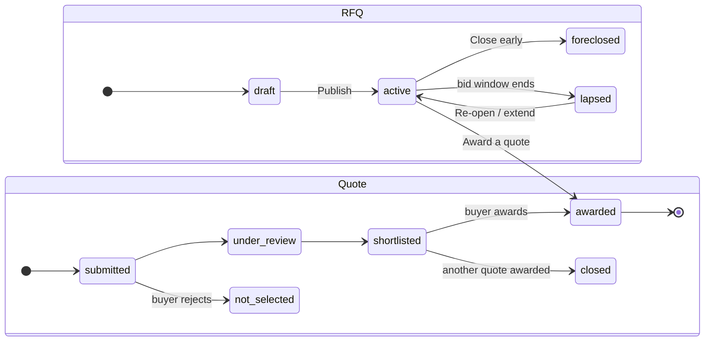

# SourceSutra — User Journeys & Flows

> A verified B2B textile sourcing network for the Indian market. Suppliers (fabric mills,
> garment CMT units, dyers, trims makers) get verified **once**, thoroughly, and become
> discoverable to manufacturers/buyers who raise **RFQs** (sourcing requests) and award work
> against supplier **quotes**.

This document maps the complete product end‑to‑end: both personas, every screen, the state
machines behind onboarding and the RFQ lifecycle, the shared data models, and the prototype's
known gaps. It is derived from the design project *"Demo flows and design system"* imported via
the Claude Design MCP.

---

## Table of contents

1. [The product in one picture](#1-the-product-in-one-picture)
2. [Personas & the two apps](#2-personas--the-two-apps)
3. [How it's built (fidelity & tech)](#3-how-its-built-fidelity--tech)
4. [Design language](#4-design-language)
5. [Entry points & authentication](#5-entry-points--authentication)
6. [Supplier journey](#6-supplier-journey)
7. [Customer / buyer journey](#7-customer--buyer-journey)
8. [The RFQ ↔ Quote lifecycle (cross‑persona)](#8-the-rfq--quote-lifecycle-crosspersona)
9. [Shared data models](#9-shared-data-models)
10. [Status vocabularies](#10-status-vocabularies)
11. [Prototype scope & known gaps](#11-prototype-scope--known-gaps)
12. [Working copy: local run, fixes & change log](#12-working-copy-local-run-fixes--change-log)
13. [Appendix — screen / file map](#13-appendix--screen--file-map)

---

## 1. The product in one picture

The two sides meet at a shared **RFQ ↔ Quote** exchange: buyers publish RFQs, verified suppliers
respond with quotes, buyers award one. A `localStorage`-backed store (`rfq-store.js`) keeps that
loop consistent across page loads.

---

## 2. Personas & the two apps

| | **Supplier** (sub‑contractor / manufacturer being found) | **Customer / Buyer** (manufacturer sourcing work) |
|---|---|---|
| Entry file | `SourceSutra.dc.html` | `SourceSutraCustomer.dc.html` |
| Demo identity | Various (scenario‑seeded, e.g. *Anand Knitfab*) | **Vardhman Textiles**, Ludhiana |
| Core job | Get verified once → be discoverable → win work | Find vetted suppliers → raise RFQs → award orders |
| Sees the other's… | Buyer RFQs (Discover RFQs) | Supplier public profile (never Identity/Financials) |

A **Customer / Supplier toggle** in each app's header links the two orchestrators, so a demo can
hop between personas. The apps are two halves of one product and share company names, the
certification taxonomy, and the RFQ/quote schema.

---

## 3. How it's built (fidelity & tech)

- **Format:** each screen is a `.dc.html` "design component" — a declarative `<x-dc>` template
  (`<sc-if>`, `<sc-for>`, `<dc-import>`, `{{ }}` bindings) plus a `class Component extends DCLogic`
  (a React‑like class with `state` + `renderVals()`), interpreted by **`support.js`** (a generated
  React runtime).
- **Two orchestrators** route between imported child screens; child screens are presentational and
  receive props + callbacks.
- **Persistence:** both apps read/write the same **`window.RFQStore`** (`localStorage`, keys
  `sourcesutra_rfqs_v3` / `sourcesutra_quotes_v3`) — so RFQs, quotes, and award/reject survive
  reloads and are shared across the two personas. `support.js` self‑loads React, ReactDOM, and Babel
  from the unpkg CDN at runtime and boots on `DOMContentLoaded`.
- **Everything asynchronous is faked** with `setTimeout` (uploads, OTP, verification all resolve on
  a ~700 ms–3.2 s timer). No backend, no real auth, synthetic PII.
- **Prototype notes (removed):** the design originally printed dashed *"user / JTBD / decision"*
  boxes on each screen for review; these have since been **stripped from all pages** (see §12).

---

## 4. Design language

- **Palette:** warm off‑white ground `#FAF8F4`, deep indigo brand `#403A77`, terracotta accent
  `#E2792A`/`#D9700F`, sage `#5B7A5B` for success, clay `#B5654A` for warnings.
- **Type:** *Fraunces* (serif) for headings, *Inter* for body.
- **Motif:** weaving / thread ("Sutra" = thread). Onboarding progress renders as **18 "weave
  slots"**; the landing page uses a selvedge stripe; the intro plays a woven animation.
- **Accessibility:** visible focus outlines, `prefers-reduced-motion` handling throughout.

---

## 5. Entry points & authentication

- **Supplier auth** is a single Google button that both signs up and logs in (`onSignup`). There is
  no password path for suppliers.
- **Customer auth** (`CustomerRegister.dc.html`): "Continue with Google" (prefills
  `priya.menon@vardhmantextiles.in`, hides password fields) **or** email + password, plus business
  info (name, company, **products you're looking to source** as tags, phone) and a required
  consent checkbox. Submit → `SourceSutraCustomer.dc.html`. Account type is fixed to *Customer
  (Buyer)*; copy notes you can switch personas from the dashboard.
- All auth is simulated — any input "works".

---

## 6. Supplier journey

### 6.0 Overview

### 6.1 Landing (`ScreenLanding.dc.html`)

Hero ("A trusted network of verified suppliers, for every need"), a **"How onboarding works"**
explainer (Identity → Financials, with Portfolio alongside), network stats, testimonials, and a
closing CTA. Primary action: **Sign up as a supplier with Google**.

### 6.2 Intro (`ScreenIntro.dc.html`)

A short cinematic bridge after signup: three cards animate in — **First: Identity → Then:
Financials → Alongside: Portfolio** — over a woven background with audio, an **Enter** (skip)
button, and *"Setting up your dashboard…"*. Driven by a stepped timer in the orchestrator
(`introStep` 0→3, ~3.3 s total; skipped instantly under reduced‑motion).

### 6.3 Dashboard · Overview (`ScreenDashboard.dc.html`)

The onboarding home. Shows the **weave progress bar + % complete**, an **Overall status** banner
with guidance copy, and three **section cards** (Identity, Financials, Portfolio) each with a status
chip. Financials shows a 🔒 lock reason until Identity is submitted. A **scenario switcher** (demo
tool) lets you jump the whole profile to any onboarding state.

**The three sections build on each other:**

| Section | Weight | Gating | Purpose |
|---|---|---|---|
| **Identity** | 40% | Always open; submit first | Company + contact identity, verified once |
| **Financials** | 40% | 🔒 **Locked until Identity is submitted** | Bank + legal filings |
| **Portfolio** | 20% | Open any time; **submitted last** | The public shopfront |

### 6.4 Identity form

Company/firm name, primary contact + **designation**, **Aadhaar OTP** verification (demo OTP shown
on screen; *only the result is kept, never the number*), **email** + OTP, **phone** + OTP, alternate
contact, website, **company directors** (each individually Aadhaar‑verifiable), established date,
years in business, nature of business, and registration docs **GST / PAN / MSME / CIN** (upload
simulation with per‑doc status badges + error/remediation messages). Actions: **Cancel / Save draft
/ Submit for verification**.

### 6.5 Financials form (locked until Identity submitted)

Bank details (country, bank, beneficiary, **routing type** IFSC/Bank Code/BSB/Sort Code/Transit,
routing code, **account number + confirm** with mismatch check), **billing address**, **legal entity
address** + tax code + tax docs, and **company documents**: **Form MGT‑7 for the last 3 financial
years**, signed company form, RPT declaration, and free‑form "other docs". Same Cancel / Save draft /
Submit.

### 6.6 Portfolio form

The richest section — what buyers see:

- **Company logo** + **mission** (≤100 chars)
- **Production capacity** (factory area, employees, monthly capacity, production lines)
- **Trade terms** (MOQ, incoterms, payment terms, lead time)
- **Customization capabilities** (chips from a 15‑item taxonomy: Fabric, Colour, GSM, Fit, Pattern,
  Labels, Hangtags, Packaging, Embroidery, Screen/Digital/Heat‑transfer printing, Wash/finish,
  Hardware, Trims)
- **Products** (name / category / material / MOQ / price range)
- **Certifications & licences** — a deep taxonomy (11 categories, named standards like ISO 9001,
  GOTS, GRS, SA8000, plus **Buyer/Brand Audits** with type + outcome), each with issuer, number,
  scope, facility, validity dates, documents, and a computed **badge**
  (*Verified / Self‑declared / Expiring soon / Expired / Needs correction*)
- **Facility photos**, **work history** (client / role / frequency / years / description),
  **catalogue** images, and **search tags** (with suggestions)

### 6.7 Verification lifecycle

Each section moves through its own machine; submitting simulates review, then auto‑verifies after
~3.2 s.

The **overall** status is derived from the three sections:

| Overall status | Condition |
|---|---|
| **To be Started** | all three not started |
| **Draft** | any progress, nothing verified yet |
| **Verification In Progress** | Identity or Financials submitted & pending |
| **Verification – Remediation Required** | a submitted field needs correction |
| **Verification Completed – Portfolio Required** | Identity + Financials verified, Portfolio not yet submitted |
| **Onboarding Completed** | Identity + Financials verified **and** Portfolio submitted/verified |

**Scenario presets** (demo shortcut) seed realistic end‑states with real‑ish companies —
`to_be_started`, `draft`, `in_progress`, `remediation`, `portfolio_required`, `completed` — including
a remediation example (a GST name mismatch on *Anand Knitfab*).

### 6.8 Verified vendor profile ("My profile")

Once **Onboarding Completed**, the dashboard's default view becomes the supplier's own read‑only
profile — Identity summary (contact, established, nature, ✓ doc chips), Financials summary (bank,
masked account, billing location), and Portfolio (catalogue, work history, tags) — each with an
**Edit** button. Portfolio is kept visually prominent ("what customers see first").

### 6.9 Supplier marketplace (unlocked after onboarding)

A tab bar appears: **My profile · Discover RFQs · Quotations & invitations**.

- **Discover RFQs** (`SupplierDiscoverRFQs.dc.html`): filter by contract type / location / free‑text;
  each card shows title, contract type, buyer, quantity, delivery location, and **bids‑close** date.
- **RFQ detail** (`SupplierRFQDetail.dc.html`): product & requirements, quantity/pricing/samples,
  **compliance** (required certs tagged *Must‑have* / *Nice‑to‑have*), logistics; a banner if you've
  already quoted, and **Create & submit quote**.
- **Create quote** (`SupplierCreateQuote.dc.html`): unit price / currency / basis, quantity you can
  fulfil, your MOQ, sample price + lead time (if the RFQ wants samples), bulk lead time, a
  **cert‑match readout** (*You hold this* vs *Gap*) computed against your portfolio, **customization
  chips** you can meet, incoterm, quote validity, payment terms, notes. **Save draft / Submit /
  Discard** → success screen.
- **Quotations & invitations** (`SupplierQuotations.dc.html`): two tabs. *Quotations* lists your
  quotes with status badges (Draft → Submitted → Under review → Shortlisted → Awarded /
  Not selected / Closed). *Invitations* lists RFQs a buyer invited you to (Respond / Quoted).

---

## 7. Customer / buyer journey

### 7.0 Overview

### 7.1 Customer shell (`SourceSutraCustomer.dc.html`)

Persistent header: logo, tabs **Profile · Discover suppliers · My RFQs**, Customer/Supplier toggle,
Log out, and a prominent **+ Create RFQ**. Creating an RFQ is modeled as a **takeover that disables
the tabs** (you finish or cancel). Buyer identity is fixed to **Vardhman Textiles, Ludhiana**; the
**Profile** tab is a full, editable buyer account page (see §7.6).

### 7.2 Discover suppliers (`CustomerDiscover.dc.html`)

A glassmorphic card grid over a hero image. Filter by **company type**, **location**, and **tags**
(AND across selected tags), plus an expandable search over name + mission. 12 seeded suppliers
across Tiruppur, Ludhiana, Surat, Erode, Bhilwara, Panipat. Each card → the supplier profile.

### 7.3 Supplier profile (`CustomerSupplierProfile.dc.html`)

The buyer's view of one supplier — **Identity and Financials are never shown**. Sections: header +
**Create RFQ**, **Business performance** (empty‑state in the prototype — *"populates as the supplier
completes projects"*), **Production snapshot**, **Trade terms**, **Customization capabilities**,
**Products** (click → preview modal), **Certifications & licences** grouped by category with badges
(*Certified / Claimed / Registered / Expired*; expired records stay visible for history) and
"Verify independently" links, **Facility gallery**, **Work history**, and **Contact for buyers**
(email / phone / **WhatsApp** / languages / typical response time).

### 7.4 Create RFQ — 5‑step wizard (`CustomerCreateRFQ.dc.html`)

- **Step 1 — Product & requirements:** title, category, contract/service type, manufacturing
  arrangement, customization needs, primary material, GSM, size range, colours, target market,
  additional requirements.
- **Step 2 — Quantity, pricing & samples:** total quantity + unit, optional **colour/size
  breakdown** (with running total), **pricing approach** (target price / ask suppliers / open to
  negotiation — target price never required to disclose), **bid window** (start/end, validated),
  sample requirement + type/count/deadline/who‑pays‑shipping.
- **Step 3 — Compliance & preferences:** required certifications by category, each toggled
  **Must‑have / Nice‑to‑have**; compliance notes; minimum years' experience; preferred location;
  **who can respond** (open / invite specific suppliers / verified‑only) with an invite picker.
- **Step 4 — Logistics & documents:** required delivery date (validated after bid window), lead
  time, delivery location, shipping method, incoterm, payment terms, packaging/labelling, and
  document uploads (tech pack, size chart, etc.).
- **Step 5 — Review & publish:** completion meter (required fields done, attachments, **matching
  supplier count**), timeline, editable summary groups, and visibility microcopy. **Publish** writes
  to `RFQStore` → confirmation.

Supports **Save as draft** at any step, step‑indicator navigation, prefill (invite a specific
supplier from their profile), and **resuming a draft** from My RFQs.

### 7.5 My RFQs (`CustomerMyRFQs.dc.html`)

The buyer's command center, backed by `RFQStore` (filtered to Vardhman Textiles).

- **List view:** filter chips **All / Draft / Active / Awarded / Lapsed / Foreclosed** (with counts);
  cards show status + application count; drafts route back into the wizard.
- **Detail view:** *Applications received* tab (each quote card shows price, MOQ, lead time,
  validity, and computed **cert‑match** + **customization‑coverage** against the RFQ) and an *RFQ
  spec* tab. Buyer actions: **Close early (foreclose)** on active RFQs, **Re‑open / extend** on
  lapsed RFQs with applications.
- **Application detail:** full quote breakdown, cert rows (*Held / Gap*), customization coverage,
  link to the supplier's vendor profile, and **Accept quote (award)** / **Reject quote**.
- **Modals:** reject (optional reason → *Not selected*), **award** (single‑award only; closes the
  RFQ, marks all others *Not selected*, irreversible), foreclose, reopen.

### 7.6 Buyer profile (`CustomerProfile.dc.html`)

The **Profile** tab (previously a placeholder) is now a real, editable account page built from the
register layout: an avatar + name/company header, a "Customer (Buyer)" chip, then **Account
information** (country, read‑only account type, email, and a "Change password" affordance that points
to the sign‑in reset flow rather than collecting a password) and **Business information** (name,
company, city/region, "products you source" tags, phone). Pre‑filled with the buyer (Priya Menon ·
Vardhman Textiles); **Save changes** / **Discard** with a saved‑state indicator. State is local only.

---

## 8. The RFQ ↔ Quote lifecycle (cross‑persona)

`rfq-store.js` is the shared source of truth for the buyer loop. RFQ and quote statuses move
together on award:

**`RFQStore.awardQuote(id)`** is the key transaction: it flips the winning quote → `awarded`, its RFQ
→ `awarded` (recording `awardedQuoteId`), and **every sibling quote → `closed`**. `rejectQuote`
leaves the RFQ active; `forecloseRfq` / `reopenRfq` manage the bid window. Seeded demo data already
includes an awarded RFQ (`rfq8` → *Ludhiana Woolworks*) and a live one with four competing quotes
(`rfq1`).

> **Note — unified store.** Both apps read/write the same **`localStorage` `RFQStore`** (8 RFQs + 6
> quotes). A supplier's Discover‑RFQs tab shows the store's `active` RFQs; submitting a quote calls
> `RFQStore.upsertQuote`, so it surfaces as an application in the buyer's My RFQs, and an award flips
> the RFQ + all sibling quotes for both personas. (An earlier revision kept a separate in‑memory
> supplier list; that has since been consolidated onto `RFQStore`.)

---

## 9. Shared data models

**Supplier** (buyer‑facing profile): `id, name, mission, type, location, tags[], logoBg/Fg,
catalogue[], workHistory[], production{factoryArea, employees, monthlyCapacity, productionLines},
tradeTerms{moq, incoterms, paymentTerms, leadTime}, customizationCapabilities[], products[],
facilityPhotos[], certifications[], contact{name, title, email, phone, languages, responseTime}`.

**RFQ:** `id, title, category, contractType, buyer, buyerLocation, quantity, unit, bidStart, bidEnd,
deliveryDate, deliveryLocation, primaryMaterial, gsm, sizeRange[], colours[], arrangement,
customizationNeeds[], requiredCerts[{category, name, priority}], pricingApproach, targetPrice?,
currency?, sampleRequired, sampleType?, tags[], status, publishedDate, awardedQuoteId?, closeReason?`.

**Quote:** `id, rfqId, supplierId, supplierName, status, unitPrice, currency, priceBasis,
quantityFulfil, moq, samplePrice?, sampleLeadTime?, bulkLeadTime, incoterm, paymentTerms,
quoteValidity, notes, submittedDate, certsHeld[], customizationOffered[]`.

**Certification:** `category, name, issuingBody, certNumber, scope, facility, issueDate, expiryDate?,
doesNotExpire?, fieldStatus, verificationUrl?` — plus an **audit** variant `{buyerName, auditType,
auditDate, outcome}` for the *Buyer / Brand Audits* category.

---

## 10. Status vocabularies

**Supplier onboarding — section:** `not_started → draft → submitted_pending → verified` (+ `remediation`).
**Supplier onboarding — overall:** To be Started · Draft · Verification In Progress · Verification –
Remediation Required · Verification Completed – Portfolio Required · Onboarding Completed.

**RFQ (buyer):** `draft · active · awarded · lapsed · foreclosed`.

**Quote (supplier↔buyer):** `draft · submitted · under_review · shortlisted · awarded · not_selected · closed`.

**Certification badge (computed):** Verified/Certified · Self‑declared/Claimed · Registered (regulatory) ·
Expiring soon · Expired · Needs correction · (audits) Passed / Passed with corrective actions / Failed / Pending.

---

## 11. Prototype scope & known gaps

This is a **clickable, front‑end prototype** for design review, not a working product. Notable
limits and inconsistencies observed in the code:

- **No backend / real auth / persistence** beyond `localStorage`. Uploads, OTP, and verification are
  timer‑simulated; supplier‑app state resets on logout.
- **Business performance** metrics on the supplier profile are a permanent empty state in the
  prototype (`hasPerformanceData = false`).
- **Post‑award tracking** (projects, payment milestones) is explicitly deferred ("not built yet").
- **Single‑award only** — split awards across suppliers aren't supported.
- Synthetic PII/company data throughout (GST/PAN/CIN/Aadhaar last‑4, bank details) is fictional.

---

## 12. Working copy: local run, fixes & change log

### Bugs found & fixed (applied locally **and pushed to the design project**)

Re‑importing `SourceSutra.dc.html` showed the project had been rewritten since the first import —
both apps now share `RFQStore` (see §8), which already resolved the earlier "supplier can't quote /
two disconnected stores" problems. But the rewrite introduced two regressions, both fixed here and
**pushed back upstream** (via DesignSync `write_files`) so the live prototype carries them too:

1. **Duplicate `componentDidMount`** — the class declared it twice; the second (the `RFQStore`
   loader) silently overrode the first (reduced‑motion detection), leaving `this._prm` unset. Merged
   into one method that does both.
2. **Signup never reached the dashboard** — `handleSignup` animated the intro but had no
   auto‑advance, so users were stranded on *"Setting up your dashboard…"* until they clicked
   **Enter** (and reduced‑motion users didn't skip either, because of bug 1). Restored the
   `_timer4 → _goDashboard()` auto‑advance and added `_timer4` to the skip‑timer cleanup.

Verified: exactly one `componentDidMount` remains, all script blocks parse, and the `RFQStore` award
loop works end‑to‑end (supplier submit → buyer application → award flips the RFQ + sibling quotes).

### Running it locally

The whole project is vendored into this repo and runs in a normal browser:

- **Serve over HTTP**, not `file://` — the runtime `fetch`es sibling `dc-import` screens, which
  browsers block on `file://`. Any static server works (`npx serve`, `python -m http.server`, …).
- Open **`SourceSutra.dc.html`** (supplier app) or **`SourceSutraCustomer.dc.html`** (buyer app).
- **Internet is required at runtime** — `support.js` self‑loads React/ReactDOM/Babel from the unpkg
  CDN; fonts load from Google Fonts.
- **`uploads/` must be populated** for the visuals (page backgrounds, landing hero, intro GIF +
  `.mp3`); they're referenced by relative `url('uploads/…')` paths. Two backgrounds use the design
  platform's content‑hash filenames (`…-d4fa2418.png`, `…-08ba46f0.png`) — if you only have the
  un‑suffixed originals, copy them to those names.

### Change log (this session)

1. Imported the customer app (`SourceSutraCustomer.dc.html`) + shared `support.js`.
2. Wrote this `userjourney.md` after reading all 14 screens + `rfq-store.js`.
3. Diagnosed broken flows on an older snapshot; on re‑import found them already fixed upstream, then
   fixed the two new regressions above and **pushed `SourceSutra.dc.html` back to the design project**.
4. Vendored the **complete project locally** — 14 `.dc.html`, `rfq-store.js`, `support.js` — and
   validated every script block parses and every `dc-import` resolves.
5. Populated `uploads/` and ran the app in the browser — landing background + hero, customer
   backgrounds, and the store‑backed flows all confirmed rendering.
6. **Removed all prototype‑note boxes** — 14 dashed "user / JTBD / decision" blocks across 8 pages.
7. **Added the onboarding banner background** (`uploads/onboardingbanner.png`, full‑page cover) to
   `ScreenDashboard` — behind the Overview + Identity + Financials + Portfolio onboarding screens.
8. **Built the Buyer Profile page** (`CustomerProfile.dc.html`) from the register layout and wired it
   into the customer **Profile** tab, replacing the old stub.
9. **Made the Discover‑suppliers background full‑page** (`background-size` `contain` → `cover`).

> Items 6–9 have since been **pushed to the design project** too — 11 HTML files + the new
> `uploads/onboardingbanner.png` — so the live prototype matches this working copy.

---

## 13. Appendix — screen / file map

| File | Persona | Role |
|---|---|---|
| `SourceSutra.dc.html` | Supplier | Orchestrator: routes landing/intro/dashboard + supplier marketplace; holds onboarding state + scenarios; reads/writes the shared `RFQStore` (fixed file — see §12) |
| `ScreenLanding.dc.html` | Supplier | Marketing landing + Google sign‑up |
| `ScreenIntro.dc.html` | Supplier | Post‑signup animated bridge |
| `ScreenDashboard.dc.html` | Supplier | Onboarding home + Identity/Financials/Portfolio forms + verified profile; full‑page `onboardingbanner.png` background |
| `SupplierDiscoverRFQs.dc.html` | Supplier | Browse/filter open RFQs |
| `SupplierRFQDetail.dc.html` | Supplier | Full RFQ spec + compliance |
| `SupplierCreateQuote.dc.html` | Supplier | Quote form with cert‑match |
| `SupplierQuotations.dc.html` | Supplier | Quotes + invitations pipeline |
| `SourceSutraCustomer.dc.html` | Customer | Orchestrator: shell/tabs + `SUPPLIERS` directory data |
| `CustomerRegister.dc.html` | Customer | Buyer sign‑up |
| `CustomerProfile.dc.html` | Customer | Editable buyer account page (Profile tab; built from the register layout) |
| `CustomerDiscover.dc.html` | Customer | Browse/filter suppliers; full‑page cover background |
| `CustomerSupplierProfile.dc.html` | Customer | Public supplier profile (no Identity/Financials) |
| `CustomerCreateRFQ.dc.html` | Customer | 5‑step RFQ wizard → `RFQStore` |
| `CustomerMyRFQs.dc.html` | Customer | RFQ list → applications → award/reject/close/reopen |
| `rfq-store.js` | Shared | `localStorage` RFQ + Quote store; award/reject/foreclose/reopen |
| `support.js` | Shared | Generated React runtime for the `.dc.html` format |
| `uploads/` | Shared | Page backgrounds, landing hero image, intro GIF + `.mp3` audio (relative‑path refs; must be present locally) |

---

*Generated from the Claude Design project `b32cd8b6-9529-4809-8831-5cc086b151d3` ("Demo flows and
design system"). Now **15 screens** (added `CustomerProfile.dc.html`) + shared runtime, store, and
`uploads/` assets. All changes — the `SourceSutra.dc.html` fix and the later working‑copy changes
(prototype‑note removal, onboarding banner, Buyer Profile page, Discover cover background, plus the
new `CustomerProfile.dc.html` and `onboardingbanner.png`) — have been pushed to the design project.
Last updated 2026‑08‑10.*
